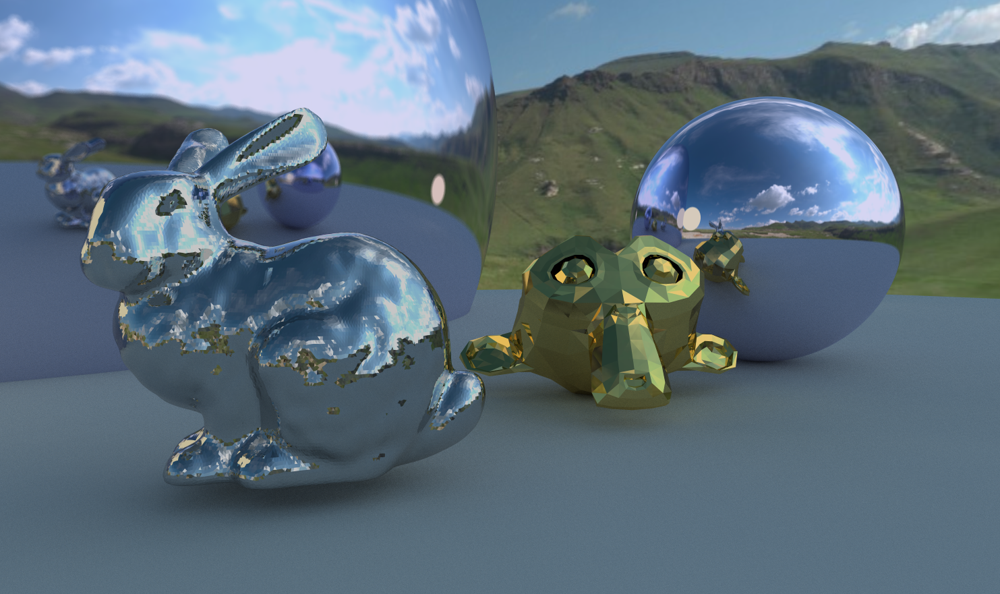
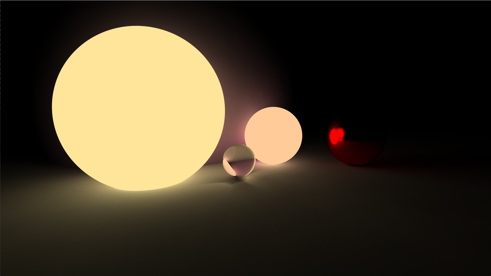
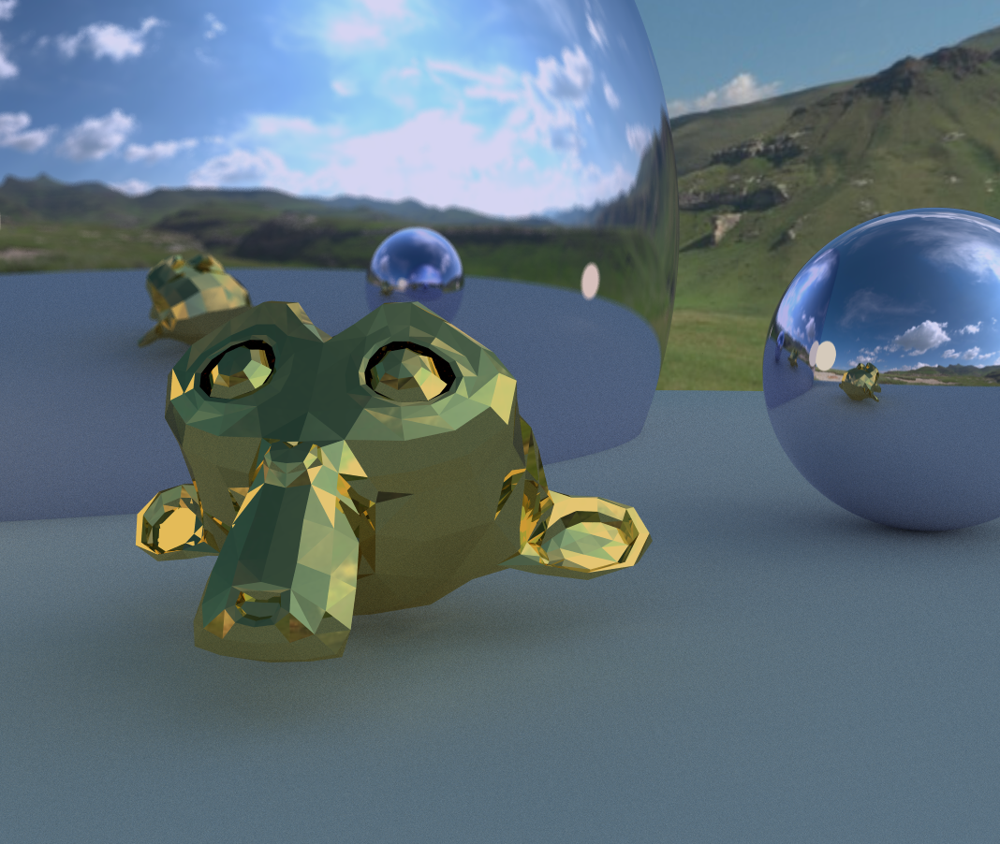
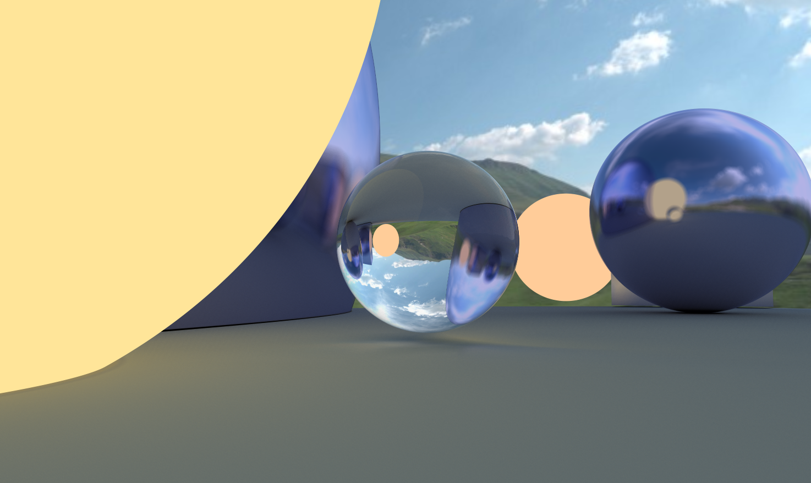
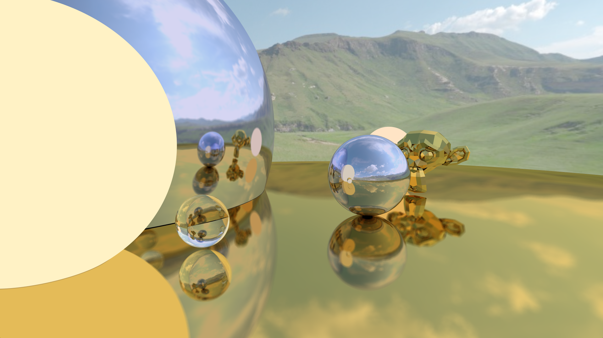
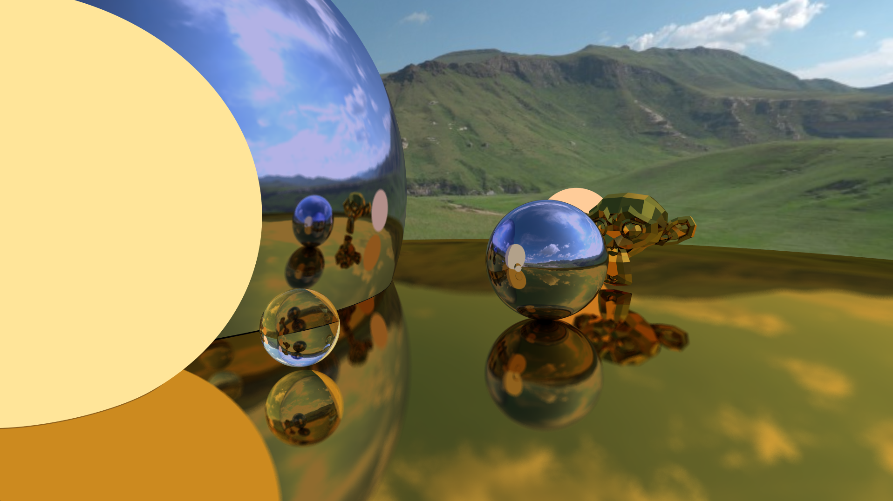
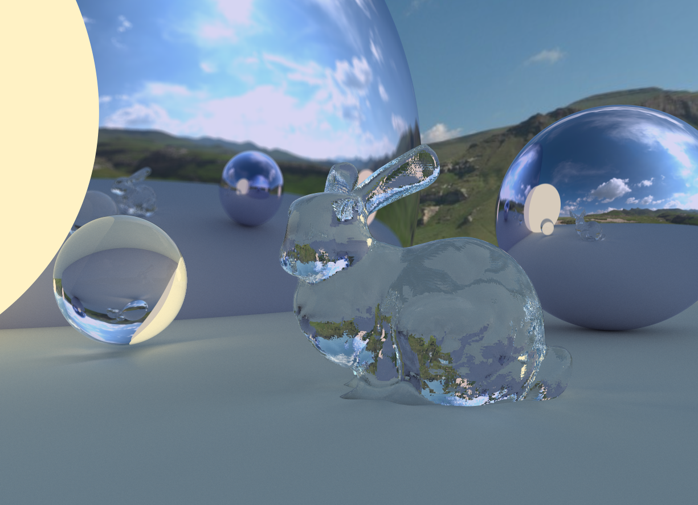
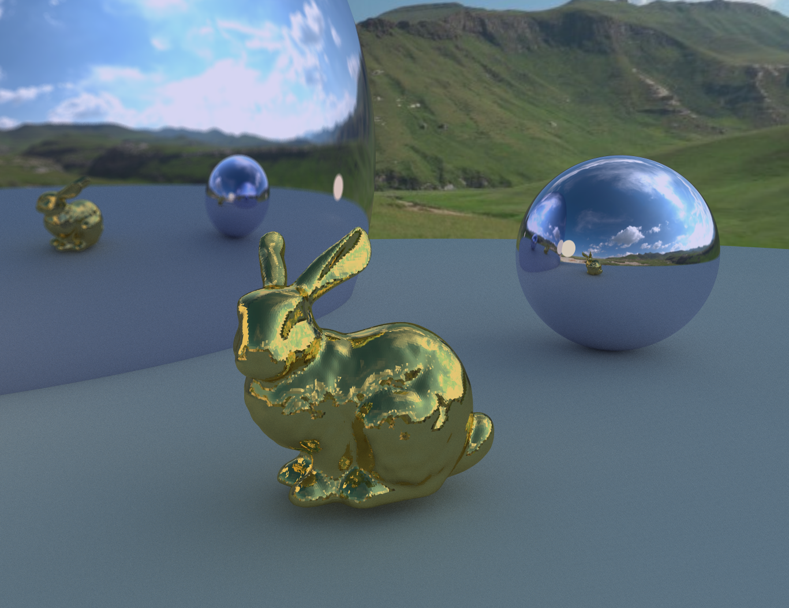
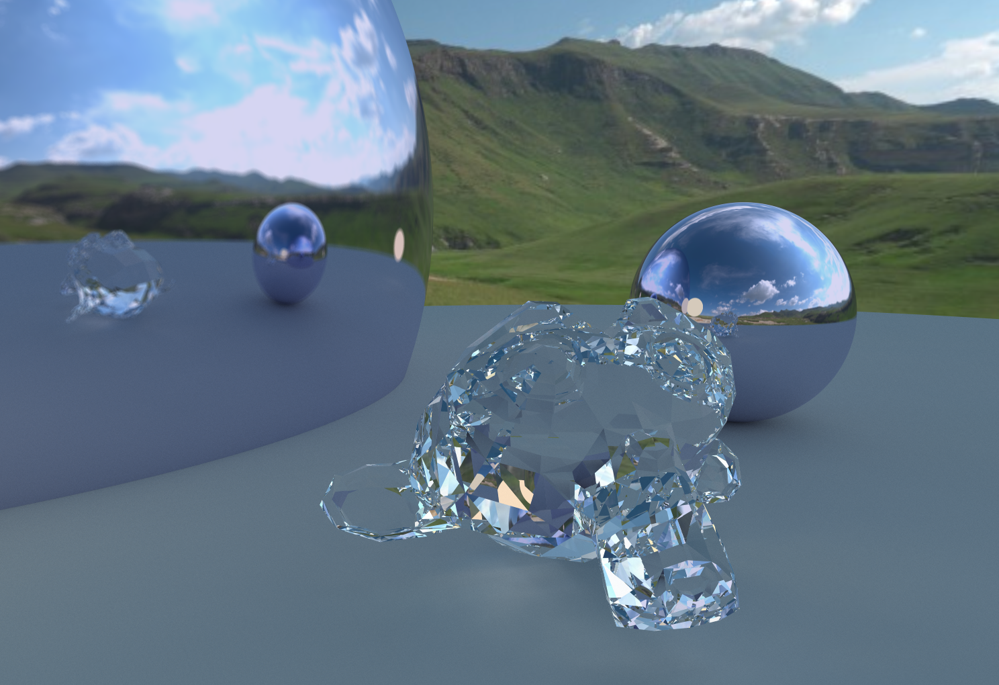

# Realtime Ray Tracer  

A **GPU-accelerated real-time ray tracer** written in **C++ and OpenGL**, built as an educational and experimental project. All ray generation, intersection, and shading are handled entirely in the fragment shader, rendered to a full-screen quad, and accumulated over multiple frames for progressive refinement.  

**Author**: Aidan Fox  

---

## 🚀 Features  

- **GPU-side rendering** – Ray generation and shading happen almost entirely in GLSL.  
- **BVH Construction** – CPU builds a bounding volume hierarchy for static meshes; BVH is uploaded to GPU buffers for fast ray/scene intersection.  
- **Progressive ray accumulation** – Accumulates samples across frames for smooth noise reduction.  
- **Multiple primitives** – Supports spheres and triangle meshes.  
- **Skybox rendering** – Environment lighting with cubemaps.  
- **Material system** – Lambertian (diffuse), Metal, Dielectric (glass), and Emissive materials supported.
- **Interactive GUI** - Realtime mesh position, rotation, and scale control using ImGui.  
- **Educational focus** – Inspired by *Ray Tracing in One Weekend*, extended to real-time GPU rendering.

---

## 📸 Showcase  

| Glass & Refraction | BVH Triangle Mesh | Skybox Environment | 
|--------------------|-------------------|--------------------|
|  |  |  |

| Gamma-Correction | No Gamma-Correction |
|------------------|---------------------|
|  |  |

### Post Triangle Intersection and Normal Interpolation Fix for Meshes

| Glass Bunny | Brass Bunny |
|-------------|-------------|
|  |  |

| Glass Monkey | Brass Monkey |
|-------------|-------------|
|  |  |

---

## 🛠️ Build Instructions  

### Requirements  
- Windows  
- Visual Studio (tested with VS 2022)  
- OpenGL **4.3+** (uses SSBOs)  
- Dependencies:  
  - [GLFW](https://www.glfw.org/)  
  - [GLAD](https://glad.dav1d.de/) (OpenGL 4.6 core)  [Alternate Link](https://gen.glad.sh/)
  - [Assimp](https://github.com/assimp/assimp) (mesh loading)  
  - [stb_image](https://github.com/nothings/stb) (image loading)
  - [ImGui](https://github.com/ocornut/imgui) (interactive GUI)

### Setup  
1. Clone this repository.  
2. Open the Visual Studio solution (`.sln`).  
3. Ensure dependencies are available (either included as source or linked via VS project).  
4. Build and run from Visual Studio.  

⚠️ *Note: Visual Studio projects can be finicky. If you run into missing DLLs or include errors, check your library/include paths for GLFW, GLAD, and Assimp.*  

---

## 🎮 Usage  

When running the program:  
- The scene is rendered progressively, improving over time.  
- The default scene includes spheres, a loaded mesh, and a cubemap skybox.  
- You can modify scene parameters (primitives, materials, skybox) in the source code.  

---

## 📚 Influences & References  

- [*Ray Tracing in One Weekend*](https://raytracing.github.io/) – Peter Shirley  
- [LearnOpenGL](https://learnopengl.com/) – Joey de Vries  

---

## 🔮 Future Work  

- Support for textures (diffuse/normal maps).  
- More primitive types (planes, cylinders, implicit surfaces).  
- Dynamic scenes / animation.  
- Improved sampling strategies (stratified, importance sampling).  
- Denoising filters.  

---

## 📜 License  

This project is released for educational and portfolio purposes. Feel free to explore, adapt, and learn from the code. 
